# Arquitectura Técnica - Canvas Dashboard

## 📋 Tabla de Contenidos

1. [Visión General del Proyecto](#1-visión-general-del-proyecto)
2. [Stack Tecnológico](#2-stack-tecnológico)
3. [Arquitectura de Alto Nivel](#3-arquitectura-de-alto-nivel)
4. [Análisis por Capas](#4-análisis-por-capas)
5. [Flujo de Datos](#5-flujo-de-datos)
6. [Implementación de Características Clave](#6-implementación-de-características-clave)
7. [Patrones de Diseño Aplicados](#7-patrones-de-diseño-aplicados)

---

## 1. Visión General del Proyecto

### 1.1 Propósito

Canvas Dashboard es una aplicación web que rediseña el dashboard móvil de Canvas LMS para funcionar en web (desktop y mobile), centralizando datos dispersos en Canvas en un único dashboard interactivo. Los estudiantes pueden visualizar:

- **Calificaciones en tiempo real** - Notas actuales de todos los cursos
- **Análisis de tendencias** - Identificación de mejora/declive en rendimiento
- **Analítica predictiva** - Predicción de calificaciones finales usando regresión lineal
- **Desglose por categorías** - Rendimiento por tipo de tarea (exámenes, labs, proyectos)
- **Tareas próximas** - Próximos 7 días de entregas
- **Gráficos de progreso** - Visualización de cambios acumulativos de calificación

### 1.2 Valor Agregado

- **Ahorro de tiempo**: Consolida 5+ páginas de Canvas en 1 vista
- **Insights accionables**: Análisis de tendencias y predicciones para identificar cursos que necesitan atención
- **Planificación**: Visualización de puntos restantes y deadlines
- **Reducción de estrés**: Retroalimentación visual clara del rendimiento

---

## 2. Stack Tecnológico

### 2.1 Backend


- **Spring Boot 3.5.5**: Framework principal del backend
- **Spring Security**: Autenticación y autorización
- **Spring MVC**: Patrón Modelo-Vista-Controlador
- **Java 17**: Lenguaje de programación
- **Maven**: Gestión de dependencias y build

### 2.2 Frontend

- **Thymeleaf**: Motor de plantillas server-side
- **HTMX 4.0.1**: Interactividad dinámica sin JavaScript pesado
- **Tailwind CSS**: Framework de estilos utility-first
- **Lucide Icons**: Librería de iconos

### 2.3 Integración Externa

- **Canvas LMS API**: API RESTful de Canvas para obtener datos del estudiante
- **RestTemplate**: Cliente HTTP de Spring para llamadas a Canvas API

---

## 3. Arquitectura de Alto Nivel

El proyecto implementa dos patrones arquitectónicos complementarios:

### 3.1 Arquitectura Hexagonal (Ports & Adapters)


**Beneficios clave:**

1. **Testabilidad**: Los servicios dependen de interfaces (ports), no implementaciones
2. **Flexibilidad**: Fácil cambiar Canvas API por otra fuente de datos
3. **Desarrollo paralelo**: Adaptadores y lógica de negocio se pueden desarrollar independientemente
4. **Aislamiento**: La lógica de negocio no conoce detalles de la API externa

### 3.2 Patrón MVC (Model-View-Controller)


---

## 4. Análisis por Capas

### 4.1 Capa de Dominio (Entities)

Las entidades representan los conceptos del dominio Canvas. Usan **campos públicos** en lugar de getters/setters para reducir boilerplate (decisión de diseño del equipo).

#### 4.1.1 User
```java
// src/main/java/.../model/entities/User.java
```

**Responsabilidad**: Representar al usuario autenticado de Canvas

**Campos principales**:
- `id`: Identificador único del usuario
- `name`: Nombre completo
- `canvasToken`: Token de API de Canvas
- `tokenExpiry`: Fecha de expiración del token

#### 4.1.2 Course
```java
// src/main/java/.../model/entities/Course.java
```

**Responsabilidad**: Representar un curso de Canvas

**Campos principales**:
- `id`: ID del curso
- `name`: Nombre del curso
- `code`: Código del curso (ej: "CS101")
- `enrollmentType`: Tipo de matrícula (Student/Teacher/TA)
- `currentGrade`: Calificación actual del estudiante

#### 4.1.3 Enrollment
```java
// src/main/java/.../model/entities/Enrollment.java
```

**Responsabilidad**: Representar la matrícula de un estudiante en un curso con sus calificaciones

**Campos principales**:
- `courseId`: ID del curso
- `currentScore`: Puntaje actual (0-100)
- `finalScore`: Puntaje final
- `currentGrade`: Letra de calificación (A, B+, etc.)
- `lastActivityAt`: Última actividad del estudiante

**⭐ Importancia**: Este es el repositorio MÁS IMPORTANTE porque Canvas calcula las notas aquí. Una sola llamada API obtiene todas las calificaciones.

#### 4.1.4 Assignment
```java
// src/main/java/.../model/entities/Assignment.java
```

**Responsabilidad**: Representar una tarea/examen/proyecto

**Campos principales**:
- `id`: ID de la tarea
- `name`: Nombre de la tarea
- `dueAt`: Fecha de entrega
- `pointsPossible`: Puntos máximos
- `assignmentGroupId`: ID del grupo (categoría)

#### 4.1.5 Submission
```java
// src/main/java/.../model/entities/Submission.java
```

**Responsabilidad**: Representar la entrega de un estudiante

**Campos principales**:
- `assignmentId`: ID de la tarea
- `score`: Puntuación obtenida
- `gradedAt`: Fecha de calificación
- `late`: ¿Entrega tardía?

**Método clave**: `isGraded()` - Verifica si la tarea ya fue calificada

#### 4.1.6 AssignmentGroup
```java
// src/main/java/.../model/entities/AssignmentGroup.java
```

**Responsabilidad**: Representar categorías de tareas (Exámenes, Labs, Proyectos)

**Campos principales**:
- `id`: ID del grupo
- `name`: Nombre de la categoría
- `groupWeight`: Peso en la calificación final (ej: 40% para exámenes)

---

### 4.2 Capa de Repositorios (Ports - Interfaces)

Los **Ports** son interfaces que definen contratos para acceso a datos. Siguen el **patrón Repository**.

```mermaid
classDiagram
    class CourseRepository {
        <<interface>>
        +findAllActiveCourses() List~Course~
    }

    class EnrollmentRepository {
        <<interface>>
        +findAllEnrollments() List~Enrollment~
        +findEnrollmentByCourseId(courseId) Enrollment
    }

    class AssignmentRepository {
        <<interface>>
        +findAssignmentsByCourseId(courseId) List~Assignment~
        +findAssignmentById(courseId, assignmentId) Assignment
        +findUpcomingAssignments(courseId, days) List~Assignment~
    }

    class SubmissionRepository {
        <<interface>>
        +findSubmissionsByCourseId(courseId) List~Submission~
        +findSubmissionByAssignmentId(courseId, assignmentId) Submission
        +findRecentGrades(courseId, limit) List~Submission~
    }

    class AssignmentGroupRepository {
        <<interface>>
        +findAssignmentGroupsByCourseId(courseId) List~AssignmentGroup~
        +findAssignmentGroupById(courseId, groupId) AssignmentGroup
    }
```



**Ventajas del patrón Port**:
1. **Inversión de dependencias**: Los servicios dependen de abstracciones, no de implementaciones concretas
2. **Testabilidad**: Fácil crear mocks/stubs de repositorios para pruebas
3. **Intercambiabilidad**: Cambiar de Canvas a otro LMS solo requiere nuevos adaptadores

---

### 4.3 Capa de Adaptadores (Implementations)

Los **Adaptadores** implementan los Ports y se comunican con la Canvas API usando `RestTemplate`.

#### 4.3.1 Patrón de Implementación

Todos los adaptadores siguen el mismo patrón:

```java
@Primary  // Indica que esta es la implementación por defecto
@Repository("canvasXRepository")
public class CanvasXRepository implements XRepository {

    @Value("${canvas.instance.url}")
    private String canvasInstanceUrl;

    private final RestTemplate restTemplate;

    // 1. Obtener token del SecurityContext
    private String getApiToken() {
        Authentication auth = SecurityContextHolder.getContext().getAuthentication();
        Map<String, Object> details = (Map) auth.getDetails();
        return (String) details.get("apiToken");
    }

    // 2. Llamar Canvas API
    @Override
    public List<Entity> findAll() {
        HttpHeaders headers = new HttpHeaders();
        headers.set("Authorization", "Bearer " + getApiToken());

        ResponseEntity<List> response = restTemplate.exchange(
            canvasInstanceUrl + "/api/v1/endpoint",
            HttpMethod.GET,
            new HttpEntity<>(headers),
            List.class
        );

        return mapToEntities(response.getBody());
    }

    // 3. Mapear JSON a Entity
    private List<Entity> mapToEntities(List<Map> data) { ... }
}
```

#### 4.3.2 Ejemplo: CanvasEnrollmentRepository

**Ubicación**: `src/main/java/.../model/adapters/CanvasEnrollmentRepository.java`

**Endpoints de Canvas usados**:
- `GET /api/v1/users/self/enrollments?per_page=100`

**Flujo**:
1. Obtiene token de autenticación del contexto de seguridad
2. Hace llamada HTTP GET a Canvas API con header `Authorization: Bearer {token}`
3. Mapea respuesta JSON a objetos `Enrollment`
4. Extrae calificaciones del objeto `grades` en la respuesta

**Mapeo JSON → Enrollment**:
```java
private Enrollment mapToEnrollment(Map<String, Object> data) {
    Map<String, Object> grades = (Map) data.get("grades");

    Integer courseId = (Integer) data.get("course_id");
    String enrollmentState = (String) data.get("enrollment_state");
    Double currentScore = getDouble(grades.get("current_score"));
    String currentGrade = (String) grades.get("current_grade");

    return new Enrollment(courseId, enrollmentState, currentScore, ...);
}
```

#### 4.3.3 Gestión de Timeouts

Los adaptadores configuran timeouts para evitar bloqueos:

```java
this.restTemplate = new RestTemplateBuilder()
    .connectTimeout(Duration.ofSeconds(10))  // Timeout de conexión
    .readTimeout(Duration.ofSeconds(10))     // Timeout de lectura
    .build();
```

---

### 4.4 Capa de Servicios (Business Logic)

Los servicios contienen la **lógica de negocio** y orquestan repositorios.

#### 4.4.1 DashboardService

**Ubicación**: `src/main/java/.../model/services/DashboardService.java`

**Responsabilidad**: Orquestar la obtención de todos los datos del dashboard en paralelo

**Arquitectura de Concurrencia**:


**Código simplificado**:
```java
@Service
public class DashboardService {
    // Pool de 20 threads que propaga SecurityContext
    private final ExecutorService executor =
        new DelegatingSecurityContextExecutorService(
            Executors.newFixedThreadPool(20)
        );

    public DashboardData getDashboardData() {
        // Paso 1: Fetch paralelo de courses y enrollments
        CompletableFuture<List<Course>> coursesFuture =
            CompletableFuture.supplyAsync(() ->
                courseRepository.findAllActiveCourses(), executor);

        CompletableFuture<List<Enrollment>> enrollmentsFuture =
            CompletableFuture.supplyAsync(() ->
                enrollmentRepository.findAllEnrollments(), executor);

        // Esperar a ambos
        CompletableFuture.allOf(coursesFuture, enrollmentsFuture).join();
        List<Course> courses = coursesFuture.join();
        List<Enrollment> enrollments = enrollmentsFuture.join();

        // Paso 2: Por cada curso, fetch paralelo de datos
        List<CompletableFuture<CourseCardData>> cardFutures =
            courses.stream().map(course ->
                CompletableFuture.supplyAsync(() -> {
                    // Fetch assignments, submissions, groups en paralelo
                    // ...
                    return buildCourseCardData(...);
                }, executor)
            ).collect(Collectors.toList());

        // Paso 3: Agregar y retornar
        List<CourseCardData> courseCards = cardFutures.stream()
            .map(CompletableFuture::join)
            .collect(Collectors.toList());

        return new DashboardData(courseCards, ...);
    }
}
```

**⭐ Punto clave**: Uso de `DelegatingSecurityContextExecutorService` para propagar el `SecurityContext` (token de Canvas) a threads hijos. Sin esto, los adaptadores no tendrían acceso al token.

**Método buildCourseCardData**:

Este método construye los datos de una tarjeta de curso:

1. **Recent Grades**: Últimas 5 calificaciones ordenadas por fecha
2. **Category Breakdown**:
   - Agrupa tareas por `assignmentGroupId`
   - Calcula puntos obtenidos/posibles por categoría
   - Computa porcentaje de rendimiento
3. **Upcoming Assignments**: Tareas con `dueAt` entre ahora y 7 días
4. **Trend**: Compara promedio de primera mitad vs segunda mitad de calificaciones recientes
5. **Remaining Points**: Puntos restantes como porcentaje del total

**Cálculo de Tendencia**:
```java
private String calculateTrend(List<RecentGrade> recentGrades) {
    int halfSize = recentGrades.size() / 2;

    double firstHalfAvg = recentGrades.stream()
        .limit(halfSize)
        .mapToDouble(g -> (g.submission.score / g.assignment.pointsPossible) * 100)
        .average().orElse(0.0);

    double secondHalfAvg = recentGrades.stream()
        .skip(halfSize)
        .mapToDouble(g -> (g.submission.score / g.assignment.pointsPossible) * 100)
        .average().orElse(0.0);

    if (firstHalfAvg > secondHalfAvg + 5) return "up";
    if (secondHalfAvg > firstHalfAvg + 5) return "down";
    return "stable";
}
```

#### 4.4.2 PredictionService

**Ubicación**: `src/main/java/.../model/services/PredictionService.java`

**Responsabilidad**: Calcular predicciones de calificación final usando **regresión lineal**

**Algoritmo**:



```mermaid
graph TD
    A[Recibir DashboardData] --> B[Extraer tareas calificadas]
    B --> C[Convertir a puntos x,y]
    C --> D{¿Al menos 5 puntos?}
    D -->|No| E[Retornar sin predicción]
    D -->|Sí| F[Calcular regresión lineal]
    F --> G[Obtener pendiente e intercepto]
    G --> H[Por cada tarea NO calificada]
    H --> I[Predecir score usando y = mx + b]
    I --> J[Sumar puntos predichos]
    J --> K[Calcular porcentaje final]
    K --> L[Convertir a letra A-F]
    L --> M[Generar gráfico de progresión]
    M --> N[Retornar PredictionData]
```

**Regresión Lineal**:

La regresión lineal encuentra la línea `y = mx + b` que mejor se ajusta a los datos.

**Variables**:
- `x`: Días desde la primera calificación hasta la fecha de entrega
- `y`: Porcentaje obtenido en la tarea (score/pointsPossible * 100)

**Fórmulas**:
```
slope (m) = (n*ΣXY - ΣX*ΣY) / (n*ΣX² - (ΣX)²)
intercept (b) = (ΣY - m*ΣX) / n
```

**Código**:
```java
// Convertir calificaciones a puntos (x,y)
Instant firstGradedDate = gradedRecentGrades.get(0).submission.gradedAt;
List<DataPoint> dataPoints = new ArrayList<>();

for (RecentGrade rg : gradedRecentGrades) {
    double x = Duration.between(firstGradedDate,
        rg.submission.gradedAt).toDays();
    double y = (rg.submission.score / rg.assignment.pointsPossible) * 100;
    dataPoints.add(new DataPoint(x, y));
}

// Calcular sumas
double sumX = 0, sumY = 0, sumXY = 0, sumX2 = 0;
for (DataPoint p : dataPoints) {
    sumX += p.x();
    sumY += p.y();
    sumXY += p.x() * p.y();
    sumX2 += p.x() * p.x();
}

// Regresión lineal
int n = dataPoints.size();
double slope = (n * sumXY - sumX * sumY) / (n * sumX2 - sumX * sumX);
double intercept = (sumY - slope * sumX) / n;

// Predecir scores futuros
for (Assignment ungradedAssignment : ungradedAssignments) {
    double x = Duration.between(firstGradedDate,
        ungradedAssignment.dueAt).toDays();
    double predictedScore = slope * x + intercept;
    predictedScore = Math.max(0, Math.min(100, predictedScore)); // Clamp 0-100
    totalPredictedPoints += (predictedScore / 100) * assignment.pointsPossible;
}
```

**Cálculo de Calificación Final**:
```java
double finalPredictedPercentage =
    ((totalEarnedPoints + totalPredictedPoints) / totalPossiblePoints) * 100;

String letterGrade = convertToLetterGrade(finalPredictedPercentage);
```

**Escala de Calificación**:
```java
private String convertToLetterGrade(double percentage) {
    if (percentage >= 93) return "A";
    if (percentage >= 90) return "A-";
    if (percentage >= 87) return "B+";
    if (percentage >= 83) return "B";
    if (percentage >= 80) return "B-";
    // ... hasta F
}
```

**Gráfico de Progresión**:

Genera puntos de datos acumulativos para mostrar cómo ha cambiado la calificación:

```java
private List<ChartDataPoint> generateGradeProgression(List<RecentGrade> grades) {
    List<ChartDataPoint> progression = new ArrayList<>();
    double cumulativeScore = 0;
    double cumulativePossible = 0;

    for (int i = 0; i < grades.size(); i++) {
        cumulativeScore += grades.get(i).submission.score;
        cumulativePossible += grades.get(i).assignment.pointsPossible;

        double currentOverall = (cumulativeScore / cumulativePossible) * 100;
        progression.add(new ChartDataPoint("Assign. " + (i+1), currentOverall));
    }
    return progression;
}
```

---

### 4.5 Capa de DTOs (Data Transfer Objects)

Los DTOs transfieren datos entre capas sin exponer entidades de dominio.


**Decisión de diseño**: Todos los DTOs usan **campos públicos** en lugar de getters/setters para:
1. Reducir boilerplate (~400 líneas menos)
2. Acceso directo desde Thymeleaf usando `${dto.field}`

---

### 4.6 Capa de Controladores (Web Layer)

#### 4.6.1 DashboardController

**Ubicación**: `src/main/java/.../controller/DashboardController.java`

**Endpoints**:

1. **GET /** → Redirect a `/dashboard`
2. **GET /dashboard** → Página principal del dashboard
3. **GET /login** → Página de inicio de sesión

**Flujo del endpoint /dashboard**:

```java
@GetMapping("/dashboard")
public String dashboard(Model model) {
    // 1. Obtener autenticación del SecurityContext
    Authentication auth = SecurityContextHolder.getContext().getAuthentication();
    Map<String, Object> userDetails = (Map) auth.getDetails();

    // 2. Agregar datos del usuario al modelo
    model.addAttribute("userName", userDetails.get("name"));
    model.addAttribute("userInitials", extractInitials(userName));

    // 3. Obtener datos del dashboard (llamadas paralelas a Canvas)
    DashboardData dashboardData = dashboardService.getDashboardData();
    model.addAttribute("dashboardData", dashboardData);

    // 4. Calcular predicciones
    PredictionData predictionData = predictionService.calculatePredictions(dashboardData);
    model.addAttribute("predictionData", predictionData);

    // 5. Retornar nombre de la vista
    return "dashboard"; // → templates/dashboard.html
}
```

**Extracto de iniciales**:
```java
private String extractInitials(String fullName) {
    String[] parts = fullName.trim().split("\\s+");
    StringBuilder initials = new StringBuilder();

    if (parts[0].length() > 0) initials.append(parts[0].charAt(0));
    if (parts.length > 1) initials.append(parts[1].charAt(0));

    return initials.toString().toUpperCase();
}
```

---

### 4.7 Capa de Configuración (Security)

#### 4.7.1 SecurityConfig

**Ubicación**: `src/main/java/.../config/SecurityConfig.java`

**Configuración de seguridad**:

```java
@Bean
public SecurityFilterChain filterChain(HttpSecurity http) throws Exception {
    http
        .authorizeHttpRequests(authz -> authz
            .requestMatchers("/login", "/authenticate", "/error",
                           "/css/**", "/js/**", "/images/**").permitAll()
            .anyRequest().authenticated()  // Todo lo demás requiere autenticación
        )
        .formLogin(form -> form
            .loginPage("/login")
            .loginProcessingUrl("/authenticate")
            .defaultSuccessUrl("/dashboard", true)
            .failureUrl("/login?error=true")
        )
        .logout(logout -> logout
            .logoutUrl("/logout")
            .logoutSuccessUrl("/login?logout=true")
            .invalidateHttpSession(true)
        )
        .authenticationProvider(canvasAuthenticationProvider)
        .csrf(csrf -> csrf.disable());  // Deshabilitado para simplificar

    return http.build();
}
```

**Rutas públicas**: `/login`, `/authenticate`, `/error`, recursos estáticos
**Rutas protegidas**: Todo lo demás (requiere autenticación)

#### 4.7.2 CanvasAuthenticationProvider

**Ubicación**: `src/main/java/.../config/CanvasAuthenticationProvider.java`

**Responsabilidad**: Validar tokens de Canvas API contra Canvas LMS

**Flujo de autenticación**:


**Código**:
```java
@Override
public Authentication authenticate(Authentication authentication)
        throws AuthenticationException {

    String apiToken = authentication.getName(); // Token del campo username

    // Validar token llamando Canvas API
    HttpHeaders headers = new HttpHeaders();
    headers.set("Authorization", "Bearer " + apiToken);

    ResponseEntity<Map> response = restTemplate.exchange(
        canvasInstanceUrl + "/api/v1/users/self",
        HttpMethod.GET,
        new HttpEntity<>(headers),
        Map.class
    );

    if (response.getStatusCode().is2xxSuccessful()) {
        Map<String, Object> user = response.getBody();
        user.put("apiToken", apiToken); // ⭐ Guardar token en detalles

        // Crear token autenticado
        UsernamePasswordAuthenticationToken authToken =
            new UsernamePasswordAuthenticationToken(
                user.get("id"),
                apiToken,
                Collections.singletonList(new SimpleGrantedAuthority("ROLE_USER"))
            );
        authToken.setDetails(user); // ⭐ Guardar detalles del usuario
        return authToken;
    }

    throw new BadCredentialsException("Invalid Canvas API token");
}
```

**⭐ Punto clave**: El token de Canvas se guarda en `authToken.setDetails(user)` para que los adaptadores puedan accederlo posteriormente desde `SecurityContextHolder`.

---

### 4.8 Capa de Vista (Templates)

#### 4.8.1 dashboard.html

**Ubicación**: `src/main/resources/templates/dashboard.html`

**Tecnologías**:
- **Thymeleaf**: Motor de plantillas
- **Tailwind CSS**: Estilos utility-first
- **Lucide Icons**: Iconos SVG
- **JavaScript vanilla**: Interactividad mínima (colapsables)

**Estructura**:

```html
<!DOCTYPE html>
<html lang="en">
<head>
    <script src="https://cdn.tailwindcss.com"></script>
    <script src="https://unpkg.com/lucide@latest/dist/umd/lucide.js"></script>
</head>
<body class="min-h-screen bg-gradient-to-br from-blue-50 to-indigo-50">

    <!-- Header -->
    <div class="bg-white/70 backdrop-blur-sm rounded-lg p-4">
        <h1>Welcome back, <span th:text="${userName}">Student</span> 👋</h1>
        <a href="/logout">Logout</a>
    </div>

    <!-- Summary Widgets (4 cards) -->
    <div class="grid grid-cols-2 md:grid-cols-4 gap-3">
        <!-- Overall Percentage -->
        <div>
            <p th:text="${#numbers.formatDecimal(
                dashboardData.summary.overallPercentage, 1, 1)} + '%'">
            </p>
        </div>
        <!-- Graded, Completed, Due Soon -->
    </div>

    <!-- Prediction Widget (if available) -->
    <div th:if="${predictionData.isPredictionAvailable()}">
        <p>Predicted:
            <span th:text="${predictionData.predictedLetterGrade}">A</span>
        </p>
        <!-- Chart -->
        <canvas id="gradeChart"></canvas>
    </div>

    <!-- Course Cards -->
    <div th:each="card : ${dashboardData.courseCards}">
        <h3 th:text="${card.courseWithGrades.course.name}">Course Name</h3>
        <p th:text="${card.courseWithGrades.enrollment.currentGrade}">A-</p>

        <!-- Category Breakdown -->
        <div th:each="cat : ${card.categoryBreakdown}">
            <p th:text="${cat.group.name}">Exams</p>
            <p th:text="${cat.earnedPoints} + '/' + ${cat.totalPoints}">
        </div>

        <!-- Recent Grades -->
        <div th:each="grade : ${card.recentGrades}">
            <p th:text="${grade.assignment.name}">Assignment 1</p>
            <p th:text="${grade.submission.score}">95</p>
        </div>
    </div>

    <!-- Upcoming Assignments -->
    <div th:each="assignment : ${dashboardData.upcomingAssignments}">
        <p th:text="${assignment.name}">Homework 5</p>
        <p th:text="${assignment.dueAt}">2024-10-20</p>
    </div>

    <script>
        lucide.createIcons(); // Inicializar iconos
    </script>
</body>
</html>
```

**Expresiones Thymeleaf clave**:
- `th:text="${variable}"`: Insertar texto
- `th:if="${condition}"`: Renderizar condicionalmente
- `th:each="item : ${list}"`: Iterar sobre listas
- `${#numbers.formatDecimal(num, 1, 1)}`: Formatear números

**Diseño Responsive**:
- `grid-cols-2 md:grid-cols-4`: 2 columnas en móvil, 4 en desktop
- `text-lg md:text-2xl`: Texto pequeño en móvil, grande en desktop

#### 4.8.2 login.html

**Ubicación**: `src/main/resources/templates/login.html`

**Estructura**:

```html
<form method="post" action="/authenticate">
    <input id="username" name="username" type="text"
           placeholder="Enter your Canvas API token">
    <input name="password" type="hidden" value="dummy">
    <button type="submit">Sign in to Canvas Dashboard</button>
</form>

<!-- Mensajes condicionales -->
<div th:if="${param.error}">
    <p>Authentication failed. Please try again.</p>
</div>

<div th:if="${param.logout}">
    <p>You have been logged out successfully.</p>
</div>
```

**Flujo**:
1. Usuario ingresa Canvas API token en campo `username`
2. Campo `password` tiene valor dummy (Spring Security requiere password)
3. POST a `/authenticate` → `CanvasAuthenticationProvider.authenticate()`
4. Si válido: Redirect `/dashboard`
5. Si inválido: Redirect `/login?error=true`

---

## 5. Flujo de Datos

### 5.1 Flujo Completo de Autenticación y Carga de Dashboard

```mermaid
sequenceDiagram
    autonumber
    participant U as Usuario
    participant B as Browser
    participant SC as SecurityConfig
    participant CAP as CanvasAuthProvider
    participant CAPI as Canvas API
    participant DC as DashboardController
    participant DS as DashboardService
    participant PS as PredictionService
    participant R as Repositories
    participant A as Adapters
    participant V as View

    U->>B: Navega a /dashboard
    B->>SC: GET /dashboard
    SC->>SC: ¿Autenticado?
    SC-->>B: No → Redirect /login
    B-->>U: Muestra login.html

    U->>B: Ingresa Canvas token
    B->>CAP: POST /authenticate
    CAP->>CAPI: GET /api/v1/users/self
    CAPI-->>CAP: User data JSON
    CAP->>SC: Guardar en SecurityContext
    SC-->>B: Redirect /dashboard

    B->>DC: GET /dashboard (autenticado)
    DC->>DS: getDashboardData()

    par Llamadas paralelas
        DS->>R: findAllActiveCourses()
        R->>A: Implementation
        A->>CAPI: GET /api/v1/courses
        CAPI-->>A: Courses JSON
        A-->>R: List<Course>
        R-->>DS: List<Course>
    and
        DS->>R: findAllEnrollments()
        R->>A: Implementation
        A->>CAPI: GET /api/v1/users/self/enrollments
        CAPI-->>A: Enrollments JSON
        A-->>R: List<Enrollment>
        R-->>DS: List<Enrollment>
    end

    loop Por cada curso
        par Llamadas paralelas por curso
            DS->>R: findAssignmentsByCourseId(id)
            R->>A: Implementation
            A->>CAPI: GET /api/v1/courses/{id}/assignments
            CAPI-->>DS: Assignments
        and
            DS->>R: findSubmissionsByCourseId(id)
            R->>A: Implementation
            A->>CAPI: GET /api/v1/courses/{id}/submissions
            CAPI-->>DS: Submissions
        and
            DS->>R: findAssignmentGroupsByCourseId(id)
            R->>A: Implementation
            A->>CAPI: GET /api/v1/courses/{id}/assignment_groups
            CAPI-->>DS: Groups
        end
        DS->>DS: buildCourseCardData()
    end

    DS->>DS: calculateSemesterSummary()
    DS-->>DC: DashboardData

    DC->>PS: calculatePredictions(dashboardData)
    PS->>PS: Regresión lineal
    PS-->>DC: PredictionData

    DC->>V: model + "dashboard"
    V->>V: Renderizar HTML con Thymeleaf
    V-->>B: HTML completo
    B-->>U: Muestra dashboard
```



### 5.2 Flujo de Obtención de Datos por Curso


---

## 6. Implementación de Características Clave

### 6.1 Análisis de Tendencias

**Objetivo**: Determinar si el rendimiento del estudiante está mejorando, empeorando o estable.

**Algoritmo**:
1. Tomar las últimas 5 calificaciones del curso
2. Dividir en dos mitades (primeras vs últimas)
3. Calcular promedio de cada mitad
4. Comparar con umbral de 5%:
   - Si primera mitad > segunda mitad + 5% → **Tendencia UP** (mejorando)
   - Si segunda mitad > primera mitad + 5% → **Tendencia DOWN** (empeorando)
   - Caso contrario → **Tendencia STABLE**

```java
private String calculateTrend(List<RecentGrade> recentGrades) {
    if (recentGrades.size() < 2) return "stable";

    int halfSize = recentGrades.size() / 2;

    // Primera mitad (calificaciones más antiguas)
    double firstHalfAvg = recentGrades.stream()
        .limit(halfSize)
        .filter(g -> g.submission.score != null && g.assignment.pointsPossible != null)
        .mapToDouble(g -> (g.submission.score / g.assignment.pointsPossible) * 100)
        .average()
        .orElse(0.0);

    // Segunda mitad (calificaciones más recientes)
    double secondHalfAvg = recentGrades.stream()
        .skip(halfSize)
        .filter(g -> g.submission.score != null && g.assignment.pointsPossible != null)
        .mapToDouble(g -> (g.submission.score / g.assignment.pointsPossible) * 100)
        .average()
        .orElse(0.0);

    // Comparar con umbral del 5%
    if (firstHalfAvg > secondHalfAvg + 5) return "up";
    if (secondHalfAvg > firstHalfAvg + 5) return "down";
    return "stable";
}
```

**Tendencia General del Semestre**:
```java
private String calculateOverallTrend(List<CourseCardData> courseCards) {
    int upCount = 0;
    int downCount = 0;

    for (CourseCardData card : courseCards) {
        if ("up".equals(card.trend)) upCount++;
        else if ("down".equals(card.trend)) downCount++;
    }

    if (upCount > downCount) return "up";
    if (downCount > upCount) return "down";
    return "stable";
}
```

### 6.2 Desglose por Categorías

**Objetivo**: Mostrar rendimiento por tipo de tarea (Exámenes, Labs, Proyectos, etc.)

**Proceso**:

1. Obtener `AssignmentGroups` del curso (ej: "Exams - 40%", "Labs - 30%")
2. Para cada grupo:
   - Filtrar `Assignments` que pertenecen al grupo
   - Para cada `Assignment`:
     - Buscar su `Submission`
     - Si está calificada, sumar puntos obtenidos y posibles
   - Calcular porcentaje: `(earnedPoints / totalPoints) * 100`

```java
List<CategoryBreakdown> categoryBreakdown = groups.stream()
    .map(group -> {
        // Filtrar assignments del grupo
        List<Assignment> groupAssignments = assignments.stream()
            .filter(a -> a.assignmentGroupId != null &&
                        a.assignmentGroupId.equals(group.id))
            .collect(Collectors.toList());

        double earnedPoints = 0.0;
        double totalPoints = 0.0;
        int completedCount = 0;

        for (Assignment assignment : groupAssignments) {
            if (assignment.pointsPossible != null) {
                // Buscar submission
                Submission submission = submissions.stream()
                    .filter(s -> s.assignmentId.equals(assignment.id))
                    .findFirst()
                    .orElse(null);

                if (submission != null && submission.score != null) {
                    earnedPoints += submission.score;
                    totalPoints += assignment.pointsPossible;
                    completedCount++;
                }
            }
        }

        double currentScore = totalPoints > 0
            ? (earnedPoints * 100.0 / totalPoints)
            : 0.0;

        return new CategoryBreakdown(
            group,
            currentScore,
            (int) earnedPoints,
            (int) totalPoints,
            completedCount,
            groupAssignments.size()
        );
    })
    .collect(Collectors.toList());
```

**Ejemplo de salida**:
```
Exams: 85% (170/200 pts) - 4/5 completed
Labs: 92% (138/150 pts) - 6/6 completed
Projects: 78% (156/200 pts) - 2/3 completed
```

### 6.3 Predicción de Calificación Final

**Objetivo**: Usar regresión lineal para predecir la calificación final del estudiante.

**Matemáticas detrás de la Regresión Lineal**:

La regresión lineal busca la recta `y = mx + b` que minimiza la distancia cuadrática entre los puntos y la línea.

**Dado**:
- `n` puntos de datos `(x₁, y₁), (x₂, y₂), ..., (xₙ, yₙ)`

**Fórmulas**:
```
m (pendiente) = (n·Σ(xy) - Σx·Σy) / (n·Σ(x²) - (Σx)²)
b (intercepto) = (Σy - m·Σx) / n
```

**Ejemplo visual**:

```
Puntos de datos (tareas calificadas):
  x (días)  |  y (%)
  ---------|---------
     0     |   85
     7     |   88
    14     |   82
    21     |   90
    28     |   87

Regresión: y = 0.14x + 85.2

Predicción para tarea en día 35:
  y = 0.14(35) + 85.2 = 90.1%
```

**Implementación completa**:

```java
public PredictionData calculatePredictions(DashboardData dashboardData) {
    // 1. Recolectar todas las tareas y calificaciones
    List<RecentGrade> gradedRecentGrades = new ArrayList<>();
    List<Assignment> allAssignments = new ArrayList<>();

    dashboardData.courseCards.forEach(card -> {
        gradedRecentGrades.addAll(card.recentGrades);
        card.recentGrades.forEach(rg -> allAssignments.add(rg.assignment));
        allAssignments.addAll(card.upcomingAssignments);
    });

    // Ordenar por fecha
    gradedRecentGrades.sort(Comparator.comparing(rg -> rg.submission.gradedAt));

    if (gradedRecentGrades.size() < 5) {
        return new PredictionData(); // Datos insuficientes
    }

    // 2. Convertir a puntos (x, y)
    Instant firstDate = gradedRecentGrades.get(0).submission.gradedAt
        .atZone(ZoneOffset.UTC).toInstant();

    List<DataPoint> dataPoints = new ArrayList<>();
    for (RecentGrade rg : gradedRecentGrades) {
        double x = Duration.between(firstDate,
            rg.submission.gradedAt.atZone(ZoneOffset.UTC).toInstant()).toDays();
        double y = (rg.submission.score / rg.assignment.pointsPossible) * 100;
        dataPoints.add(new DataPoint(x, y));
    }

    // 3. Calcular regresión lineal
    double sumX = 0, sumY = 0, sumXY = 0, sumX2 = 0;
    for (DataPoint p : dataPoints) {
        sumX += p.x();
        sumY += p.y();
        sumXY += p.x() * p.y();
        sumX2 += p.x() * p.x();
    }

    int n = dataPoints.size();
    double slope = (n * sumXY - sumX * sumY) / (n * sumX2 - sumX * sumX);
    double intercept = (sumY - slope * sumX) / n;

    // 4. Predecir scores para tareas no calificadas
    List<Integer> gradedIds = gradedRecentGrades.stream()
        .map(rg -> rg.assignment.id).toList();

    List<Assignment> ungradedAssignments = allAssignments.stream()
        .filter(a -> !gradedIds.contains(a.id)).toList();

    double totalPredictedPoints = 0;
    for (Assignment assignment : ungradedAssignments) {
        Instant predTime = assignment.dueAt != null
            ? assignment.dueAt.atZone(ZoneOffset.UTC).toInstant()
            : Instant.now();

        double x = Duration.between(firstDate, predTime).toDays();
        double predictedScore = slope * x + intercept;
        predictedScore = Math.max(0, Math.min(100, predictedScore)); // Clamp 0-100

        totalPredictedPoints += (predictedScore / 100) * assignment.pointsPossible;
    }

    // 5. Calcular calificación final predicha
    double totalEarnedPoints = gradedRecentGrades.stream()
        .mapToDouble(rg -> rg.submission.score).sum();

    double totalPossiblePoints = allAssignments.stream()
        .mapToDouble(a -> a.pointsPossible).sum();

    double finalPercentage = ((totalEarnedPoints + totalPredictedPoints)
        / totalPossiblePoints) * 100;

    String letterGrade = convertToLetterGrade(finalPercentage);

    // 6. Generar datos de gráfico
    List<ChartDataPoint> gradeProgression = generateGradeProgression(gradedRecentGrades);

    return new PredictionData(finalPercentage, letterGrade, gradeProgression);
}
```

### 6.4 Gráfico de Progresión de Calificación

**Objetivo**: Mostrar cómo ha cambiado la calificación acumulativa a lo largo del tiempo.

**Algoritmo**:
1. Ordenar calificaciones por fecha
2. Para cada calificación:
   - Sumar puntaje obtenido acumulativo
   - Sumar puntaje posible acumulativo
   - Calcular porcentaje acumulativo
   - Agregar punto al gráfico

```java
private List<ChartDataPoint> generateGradeProgression(List<RecentGrade> grades) {
    List<ChartDataPoint> progression = new ArrayList<>();
    double cumulativeScore = 0;
    double cumulativePossible = 0;

    for (int i = 0; i < grades.size(); i++) {
        RecentGrade rg = grades.get(i);

        if (rg.submission.score != null && rg.assignment.pointsPossible != null) {
            cumulativeScore += rg.submission.score;
            cumulativePossible += rg.assignment.pointsPossible;

            if (cumulativePossible > 0) {
                double currentOverall = (cumulativeScore / cumulativePossible) * 100;
                progression.add(new ChartDataPoint("Assign. " + (i+1), currentOverall));
            }
        }
    }

    return progression;
}
```

**Ejemplo de datos generados**:
```javascript
[
  { label: "Assign. 1", value: 85.0 },
  { label: "Assign. 2", value: 86.5 },
  { label: "Assign. 3", value: 84.3 },
  { label: "Assign. 4", value: 87.0 },
  { label: "Assign. 5", value: 86.2 }
]
```

Estos datos se renderizan en el frontend usando una librería de gráficos o Canvas API.

### 6.5 Ejecución Paralela con CompletableFuture

**Objetivo**: Maximizar rendimiento haciendo múltiples llamadas a Canvas API en paralelo.

**Problema**: Si tenemos 5 cursos y cada curso necesita 3 llamadas API (assignments, submissions, groups), serían 15 llamadas secuenciales = muy lento.

**Solución**: `CompletableFuture` con `ExecutorService` de 20 threads.

**Patrón de uso**:

```java
// Pool de 20 threads que propaga SecurityContext
private final ExecutorService executor =
    new DelegatingSecurityContextExecutorService(
        Executors.newFixedThreadPool(20)
    );

public DashboardData getDashboardData() {
    // Crear futures para ejecución paralela
    CompletableFuture<List<Course>> coursesFuture =
        CompletableFuture.supplyAsync(() ->
            courseRepository.findAllActiveCourses(),
            executor);

    CompletableFuture<List<Enrollment>> enrollmentsFuture =
        CompletableFuture.supplyAsync(() ->
            enrollmentRepository.findAllEnrollments(),
            executor);

    // Esperar a que ambos terminen
    CompletableFuture.allOf(coursesFuture, enrollmentsFuture).join();

    // Obtener resultados
    List<Course> courses = coursesFuture.join();
    List<Enrollment> enrollments = enrollmentsFuture.join();

    // Por cada curso, crear un CompletableFuture
    List<CompletableFuture<CourseCardData>> cardFutures =
        courses.stream().map(course ->
            CompletableFuture.supplyAsync(() -> {
                // Dentro, más paralelismo
                CompletableFuture<List<Assignment>> assignmentsFuture =
                    CompletableFuture.supplyAsync(() ->
                        assignmentRepository.findAssignmentsByCourseId(courseId),
                        executor);

                CompletableFuture<List<Submission>> submissionsFuture =
                    CompletableFuture.supplyAsync(() ->
                        submissionRepository.findSubmissionsByCourseId(courseId),
                        executor);

                CompletableFuture<List<AssignmentGroup>> groupsFuture =
                    CompletableFuture.supplyAsync(() ->
                        assignmentGroupRepository.findAssignmentGroupsByCourseId(courseId),
                        executor);

                // Esperar los 3
                CompletableFuture.allOf(assignmentsFuture, submissionsFuture, groupsFuture).join();

                // Construir tarjeta
                return buildCourseCardData(...);
            }, executor)
        ).collect(Collectors.toList());

    // Esperar todas las tarjetas
    List<CourseCardData> courseCards = cardFutures.stream()
        .map(CompletableFuture::join)
        .collect(Collectors.toList());

    return new DashboardData(courseCards, ...);
}
```

**⭐ Importancia de DelegatingSecurityContextExecutorService**:

Por defecto, el `SecurityContext` (que contiene el token de Canvas) solo está disponible en el thread principal. Al usar threads secundarios, se pierde el contexto de seguridad.

`DelegatingSecurityContextExecutorService` **propaga** el `SecurityContext` a los threads hijos, permitiendo que los adaptadores accedan al token.

```java
// SIN delegación → ERROR (token no disponible en thread hijo)
ExecutorService executor = Executors.newFixedThreadPool(20);

// CON delegación → ✓ (token disponible)
ExecutorService executor = new DelegatingSecurityContextExecutorService(
    Executors.newFixedThreadPool(20)
);
```

---

## 7. Patrones de Diseño Aplicados

### 7.1 Hexagonal Architecture (Ports & Adapters)

**Propósito**: Aislar la lógica de negocio de detalles de infraestructura.

**Componentes**:
- **Núcleo (Domain)**: Entities, DTOs, Services
- **Ports (Interfaces)**: Repository interfaces
- **Adapters (Implementations)**: CanvasXRepository que implementan ports

**Beneficio**: Cambiar Canvas API por otra fuente de datos solo requiere crear nuevos adaptadores, sin tocar la lógica de negocio.

### 7.2 Repository Pattern

**Propósito**: Encapsular lógica de acceso a datos.

**Implementación**:
- Interfaces en `model/repositories/`
- Implementaciones en `model/adapters/`

**Beneficio**: Los servicios no conocen detalles de cómo se obtienen los datos (API REST, base de datos, mock, etc.)

### 7.3 MVC (Model-View-Controller)

**Propósito**: Separar presentación, lógica de negocio y datos.

**Componentes**:
- **Model**: DTOs (DashboardData, CourseCardData, etc.)
- **View**: Templates Thymeleaf (dashboard.html, login.html)
- **Controller**: DashboardController

**Flujo**:
```
Usuario → Controller → Service → Model → Controller → View → Usuario
```

### 7.4 DTO (Data Transfer Object)

**Propósito**: Transferir datos entre capas sin exponer entidades de dominio.

**Implementación**: Clases en `model/dto/` con campos públicos

**Beneficio**:
- Vista no depende de estructura interna de entidades
- Reducir boilerplate (sin getters/setters)

### 7.5 Dependency Injection

**Propósito**: Inyectar dependencias en lugar de crearlas manualmente.

**Implementación**: Spring Boot con constructor injection

```java
@Service
public class DashboardService {
    private final CourseRepository courseRepository;
    private final EnrollmentRepository enrollmentRepository;
    // ...

    // Constructor injection
    public DashboardService(CourseRepository courseRepository,
                            EnrollmentRepository enrollmentRepository, ...) {
        this.courseRepository = courseRepository;
        this.enrollmentRepository = enrollmentRepository;
        // ...
    }
}
```

**Beneficio**:
- Testabilidad (inyectar mocks en pruebas)
- Flexibilidad (cambiar implementaciones sin modificar código)

### 7.6 Strategy Pattern (implícito)

**Propósito**: Permitir diferentes estrategias de autenticación.

**Implementación**: `AuthenticationProvider` interface con `CanvasAuthenticationProvider` implementation

**Beneficio**: Fácil agregar OAuth2, LDAP, etc. sin modificar `SecurityConfig`

### 7.7 Template Method Pattern

**Propósito**: Definir estructura de algoritmo con pasos personalizables.

**Implementación**:
- Spring Security: `filterChain()` define flujo de autenticación
- Thymeleaf: Templates base con bloques customizables

---

## 8. Decisiones de Diseño Clave

### 8.1 Campos Públicos vs Getters/Setters

**Decisión**: Usar campos públicos en DTOs y Entities

**Justificación**:
- Reduce ~400 líneas de código boilerplate
- Thymeleaf accede directamente: `${dto.field}` en lugar de `${dto.getField()}`
- DTOs no tienen lógica de negocio que proteger
- Trade-off aceptado: Menos encapsulación por simplicidad

### 8.2 Sin Capa de Persistencia

**Decisión**: No usar base de datos, obtener datos fresh de Canvas en cada request

**Justificación**:
- Aplicación de solo lectura (no modifica datos)
- Canvas es la fuente de verdad
- Evita problemas de sincronización
- Simplifica arquitectura (no necesita JPA, Hibernate, migrations, etc.)

**Trade-off**: Mayor latencia en carga inicial (mitigado con paralelismo)

### 8.3 RestTemplate vs WebClient

**Decisión**: Usar `RestTemplate` (bloqueante) en lugar de `WebClient` (reactivo)

**Justificación**:
- `RestTemplate` es más simple y directo
- Paralelismo se maneja con `CompletableFuture` + `ExecutorService`
- Equipo más familiarizado con programación imperativa vs reactiva

**Nota**: Spring recomienda `WebClient` para nuevos proyectos, pero `RestTemplate` funciona bien aquí.

### 8.4 Server-Side Rendering vs SPA

**Decisión**: Usar Thymeleaf (SSR) en lugar de React/Vue/Angular (SPA)

**Justificación**:
- Menor complejidad (no necesita build process separado)
- SEO-friendly (aunque no es prioridad aquí)
- Primera carga más rápida
- Integración perfecta con Spring Boot

**HTMX**: Agrega interactividad sin JavaScript pesado

### 8.5 Deshabilitación de CSRF

**Decisión**: `csrf().disable()`

**Justificación**:
- Aplicación de solo lectura (no tiene formularios que modifiquen estado del servidor)
- Login usa token de Canvas (no cookies tradicionales)
- Simplifica desarrollo

**⚠️ Advertencia**: En producción con operaciones de escritura, habilitar CSRF.

---

## 9. Diagramas de Arquitectura

### 9.1 Diagrama de Componentes Completo


### 9.2 Diagrama de Secuencia - Carga de Dashboard


### 9.3 Diagrama de Clases - Domain Layer

```mermaid
classDiagram
    %% Entities
    class User {
        -String id
        -String name
        -String email
        -String avatar
        -String canvasToken
        -Date tokenExpiry
        -boolean isActive
        +getToken() String
    }

    class Course {
        +String id
        +String name
        +String code
        +String status
        +String enrollmentType
        +Date startDate
        +Date endDate
        +float totalPoints
        +float currentGrade
    }

    class Enrollment {
        +Integer courseId
        +String enrollmentState
        +Double currentScore
        +Double finalScore
        +String currentGrade
        +LocalDateTime lastActivityAt
        +Integer totalActivityTime
    }

    class Assignment {
        +Integer id
        +Integer courseId
        +String name
        +LocalDateTime dueAt
        +Double pointsPossible
        +Integer assignmentGroupId
        +String workflowState
    }

    class Submission {
        +Integer assignmentId
        +Double score
        +String workflowState
        +LocalDateTime gradedAt
        +Boolean late
        +isGraded() boolean
    }

    class AssignmentGroup {
        +Integer id
        +Integer courseId
        +String name
        +Integer position
        +Double groupWeight
    }

    %% Relationships
    Course "1" -- "1" Enrollment : has
    Course "1" -- "*" Assignment : contains
    Assignment "1" -- "1" Submission : has
    Assignment "*" -- "1" AssignmentGroup : belongs to
```



### 9.4 Diagrama de Flujo - Predicción de Calificación


---

## 10. Resumen y Conclusiones

### 10.1 Puntos Clave de la Arquitectura

1. **Arquitectura Hexagonal**: Aísla lógica de negocio de dependencias externas (Canvas API)
2. **Patrón MVC**: Separa presentación (Thymeleaf), lógica (Services), y datos (DTOs)
3. **Ejecución Paralela**: Usa `CompletableFuture` con pool de threads para maximizar rendimiento
4. **Seguridad Propagada**: `DelegatingSecurityContextExecutorService` propaga token a threads hijos
5. **Predicción Inteligente**: Regresión lineal para predecir calificaciones finales

### 10.2 Flujo de Datos Resumido

```
Usuario → Login → CanvasAuthProvider → Canvas API (validar token)
     ↓
SecurityContext (guardar token)
     ↓
Dashboard Request → DashboardController
     ↓
DashboardService → Llamadas paralelas a Canvas API (courses, enrollments, etc.)
     ↓
buildCourseCardData (calcular métricas, tendencias, categorías)
     ↓
PredictionService → Regresión lineal → Predicción
     ↓
Thymeleaf View → Renderizar HTML
     ↓
Usuario ve Dashboard completo
```

### 10.3 Tecnologías Principales

| Capa | Tecnología | Propósito |
|------|-----------|-----------|
| Backend | Spring Boot 3.5.5 | Framework principal |
| Seguridad | Spring Security | Autenticación/Autorización |
| Persistencia | Ninguna | Datos fresh de Canvas |
| API Client | RestTemplate | Llamadas HTTP a Canvas |
| Concurrencia | CompletableFuture | Paralelismo |
| Frontend | Thymeleaf | Server-side rendering |
| Estilos | Tailwind CSS | Utility-first CSS |
| Iconos | Lucide | SVG icons |
| Build | Maven | Gestión de dependencias |

### 10.4 Características Implementadas

✅ **Dashboard centralizado** - Todos los datos en una vista
✅ **Calificaciones en tiempo real** - Desde Canvas API
✅ **Análisis de tendencias** - Comparación primera/segunda mitad de calificaciones
✅ **Predicción de calificación final** - Regresión lineal sobre histórico
✅ **Desglose por categorías** - Rendimiento por tipo de tarea
✅ **Tareas próximas** - Próximos 7 días
✅ **Gráfico de progresión** - Evolución de calificación acumulativa
✅ **Diseño responsive** - Mobile y desktop
✅ **Autenticación segura** - Via Canvas API token
✅ **Rendimiento optimizado** - Llamadas paralelas

### 10.5 Posibles Mejoras Futuras

1. **Cache**: Redis/Caffeine para reducir llamadas a Canvas API
2. **WebSocket**: Actualizaciones en tiempo real
3. **Notificaciones**: Alertas cuando baja rendimiento en un curso
4. **Exportar datos**: PDF/CSV de reportes
5. **Comparación con compañeros**: Benchmarking anónimo
6. **Recomendaciones**: ML para sugerir acciones (estudiar más X categoría)
7. **Integración calendario**: Sincronizar deadlines con Google Calendar
8. **Modo offline**: Service Workers + LocalStorage

---

## 📚 Referencias

- [Spring Boot Documentation](https://spring.io/projects/spring-boot)
- [Spring Security Reference](https://docs.spring.io/spring-security/reference/)
- [Thymeleaf Documentation](https://www.thymeleaf.org/documentation.html)
- [Canvas LMS API](https://canvas.instructure.com/doc/api/)
- [CompletableFuture Guide](https://docs.oracle.com/en/java/javase/17/docs/api/java.base/java/util/concurrent/CompletableFuture.html)
- [Hexagonal Architecture Pattern](https://alistair.cockburn.us/hexagonal-architecture/)

---

**Documento creado para**: Equipo académico Canvas Dashboard
**Versión**: 1.0
**Fecha**: Octubre 2024
**Autor**: Documentación técnica generada por análisis de código
